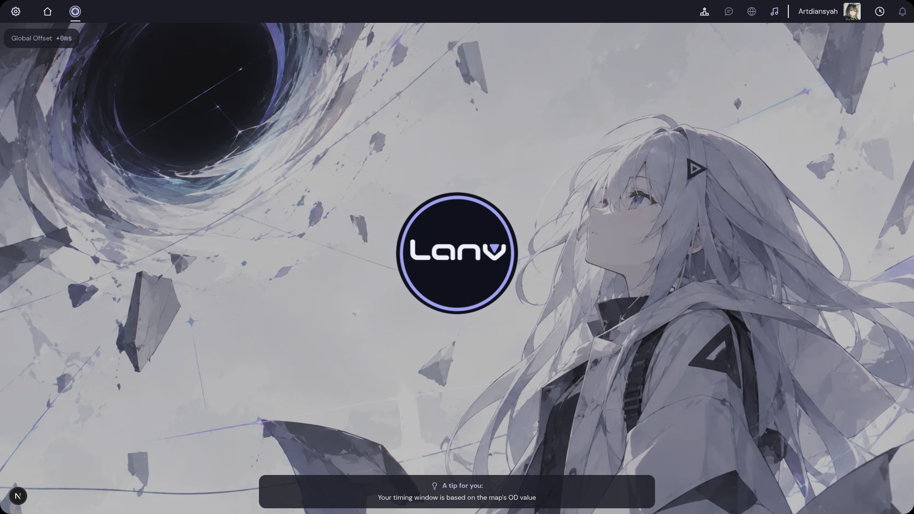

<p align="center">
  
</p>

<h1 align="center">Lany</h1>

<p align="center">A vertical scrolling rhythm game that runs in your browser. Play, sync, repeat.</p>



## What is this

Lany is a 4K and 7K key rhythm game in the style of osu!mania. You pick a song, notes fall down the lanes, and you hit them in time with the music. It reads regular `.osz` beatmap files, so a lot of existing community maps work out of the box.

This repository is the frontend. The API, database and scoring live in a separate backend repo ([lanify-be](https://github.com/Artdi222/lanify-be)).

The layout borrows a lot from osu!lazer because it simply plays well, but the look is our own. The colours come straight from our mascot art: dark slate, soft lavender and not much else.

## Features

- Gameplay with tap notes and hold notes, 4K and 7K, adjustable scroll speed and direction
- Game time locked to the audio you actually hear, plus an offset wizard that measures your setup by having you tap along to a metronome
- Song select with search, star rating filter, sorting and grouping, and a virtualized list that stays smooth with large libraries
- Global leaderboards, personal best and a result screen with accuracy graph, hit error bar and a pp breakdown
- Player profiles, rankings by performance and by country
- A music player that keeps playing in the menus
- Full settings panel with search: keybinds, audio, offset, background dim and blur, frame limit, render scale and an optional FPS counter
- Admin dashboard for uploading and managing beatmaps

## Tech stack

| Area | What we use |
| --- | --- |
| Framework | Next.js 16 (App Router), React 19, TypeScript |
| Rendering | PixiJS 7 for gameplay, Framer Motion for UI transitions |
| Audio | Howler.js, with our own clock sync on top of the Web Audio output timestamp |
| State | Zustand |
| Styling | Tailwind CSS 4, a few shadcn/ui components, custom SVG icons |
| Beatmaps | `.osz` and `.osu` parsed in the browser with JSZip |
| Tests | `bun test` |

## Running it locally

You need [Bun](https://bun.sh) and Node.js 20 or newer. The backend should be running too, otherwise the menus will load but there will be no songs.

```bash
bun install
bun run dev
```

The dev server starts on http://localhost:3001. By default the frontend talks to the API at `http://localhost:3000`. If yours lives somewhere else, create a `.env.local`:

```bash
NEXT_PUBLIC_API_URL=http://localhost:3000
```

For a production build:

```bash
bun run build
bun run start
```

## Checks

```bash
bun test lib          # unit tests for timing, judgement, scoring and friends
npx tsc --noEmit -p . # type check
bun run lint          # eslint
```

## Where things are

```
app/          routes: menu, song select, play, result, admin
components/   UI pieces, grouped by screen (menu, select, settings, profile, game)
lib/game/     the engine: audio clock, input, judgement, scoring, note renderer
lib/store/    Zustand stores for game, settings, music and auth
lib/api/      small fetch wrappers around the backend
public/       static assets, including the mascot art in public/background
```

## Credits

The beatmaps are made by the osu! community and belong to their mappers and artists. Lany is a fan project and is not affiliated with osu! or ppy.
